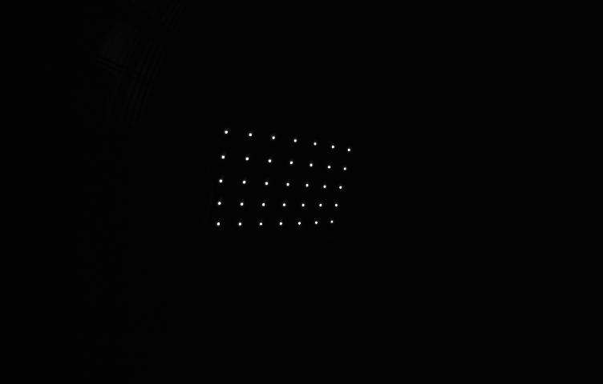
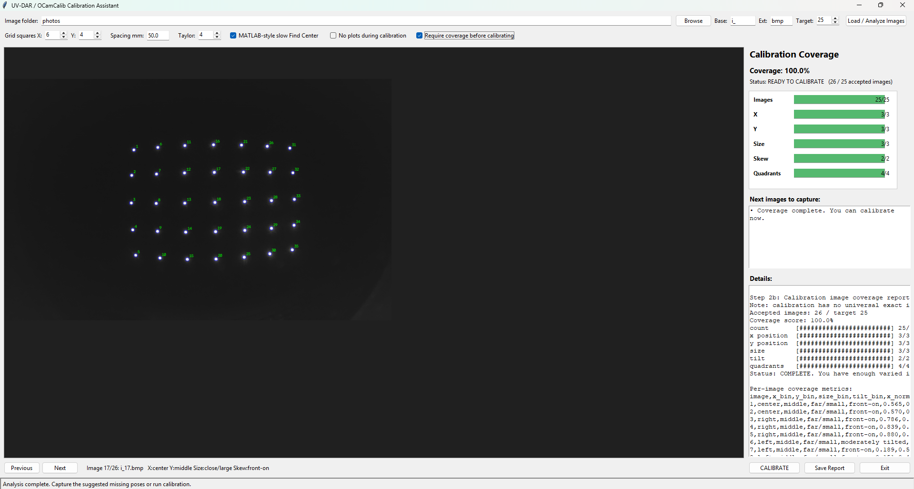

# Camera_Calibration_UVDAR
A Python-based UV-DAR camera calibration tool based on [Davide Scaramuzza's OCamCalib model](https://sites.google.com/site/scarabotix/ocamcalib-omnidirectional-camera-calibration-toolbox-for-matlab/ocamcalib-toolbox-download-page?authuser=0), adapted for UV-sensitive cameras using an LED grid calibration pattern.

This tool is intended for calibrating the UV-sensitive cameras. The calibration pattern should be a non-square UV LED grid, where the LED markers act like the internal corners of a checkerboard grid.

The Python GUI version provides calibration coverage feedback similar to ROS `camera_calibration`, including image position, size, skew, and reprojection error.

The grid should be non-square, and composed of LEDs emitting in the 395nm range.
An example of such grid:


If the camera is constructed correctly, the output image of the pattern should look like this:
 


## Overview

The full calibration workflow is:

1. Capture UV LED grid images using any suitable camera capture method such as Arducam on Raspberry Pi, Pylon Viewer, ROS/rosbags, etc.
2. Move the captured images into a folder called `photos`. The images can have any filename and may be any supported image type.
3. Run the Python calibration GUI.
4. Check that UV markers are detected correctly.
5. Use the coverage graph to determine whether more images are needed.
6. Calibrate the camera.
7. Export the final OCamCalib parameters to `calib_results.txt`.

By default, the calibration script loads every supported image in the `photos` folder.

Supported image types:

```text
jpg, jpeg, bmp, png, tif, tiff
```

## 1. Capture Calibration Images (Ex: Arducam on Raspberry Pi)

The following Raspberry Pi / Arducam process is only an example. It is not required if you are using another camera system or capture tool.

 Before running the Python calibration tool, capture calibration images using the Arducam connected to the Raspberry Pi.

Use the same exposure, gain, image size, and resolution settings for every calibration image.

Use this command to capture one image:

```bash
rpicam-still --shutter 1 -t 5000 -o center_close.bmp --encoding bmp --gain 0.05 --width 960 --height 600
```

The output filename can be anything. For example:
```text
rpicam-still --shutter 1 -t 5000 -o center_close.bmp --encoding bmp --gain 0.05 --width 960 --height 600
rpicam-still --shutter 1 -t 5000 -o left_edge.bmp --encoding bmp --gain 0.05 --width 960 --height 600
rpicam-still --shutter 1 -t 5000 -o top_corner.bmp --encoding bmp --gain 0.05 --width 960 --height 600
```

BMP is recommended for Raspberry Pi capture because it avoids extra compression artifacts, but the Python calibration script can also read other supported image types if they are placed in the photos folder.

Recommended capture settings:
```text
shutter:  1
timeout:  5000 ms
encoding: bmp recommended
gain:     0.05
width:    960
height:   600
```
## 2. Capture Good Calibration Images

For good calibration, the UV LED grid must appear in many different parts of the image.

Capture images where:

- the full UV LED grid is visible
- all LEDs are detected clearly
- LED blobs are small and not saturated
- the grid appears near the image center
- the grid appears near the left side of the image
- the grid appears near the right side of the image
- the grid appears near the top of the image
- the grid appears near the bottom of the image
- the grid appears near the image corners
- the grid appears at different distances from the camera
- the grid is tilted in different directions

A good starting point is usually:
15-25 usable images

More images can help, but image diversity is more important than the raw image count. The GUI will help determine whether enough images have been captured.

## 3. Move Images into the Python Calibration Folder

On the computer where you run the Python calibration code, create a folder named:

```text
photos
```

Place all captured calibration images inside this folder.

The expected folder structure is:

```text
camera_calibration_python/
├── ocam_calibration.py
├── photos/
│   ├── i_1.bmp
│   ├── center_close.bmp
│   ├── left_edge.png
│   ├── top_corner.jpg
│   └── calibration_view_12.tiff
```

The Python calibration script reads every supported image in the `photos` folder by default.  The images do **not** need to follow a specific naming pattern.

Valid example filenames:

```text
i_1.bmp
left_corner.png
center_close.jpg
calibration_view_12.tiff
robofly_test_image.bmp
image001.jpeg

The only requirements are:
1. The images are inside the photos folder.
2. The images are one of the supported file types.
3. The UV LED grid is visible in the image.

Optional filtering is still available. To use only files beginning with a specific prefix, use `--base_name`. To use only one image type, use `--extension`. For example:

```bash
python ./ocam_calibration.py --image_dir photos --base_name i_ --extension bmp --gui
```

## 4. Install Python Requirements

Install the required Python packages using:

```bash
pip install -r requirements.txt
```

## 5. Run the UV-DAR Calibration GUI

From the folder containing `ocam_calibration.py`, run:

```bash
python ./ocam_calibration.py --image_dir photos --gui
```

## 6. Using the GUI

In the GUI:

1. Click **Load / Analyze Images**.
2. Check that the UV markers are detected correctly.
3. Review the calibration coverage bars.
4. Add more photos if coverage is incomplete.
5. Once coverage is complete, click **CALIBRATE**.
6. Make the GUI fullscreen or large enough so the **CALIBRATE** button is visible.
7. Review the reprojection error.
8. Save or export the calibration results.

The GUI checks coverage in several categories:

```text
X coverage:       left / center / right
Y coverage:       top / middle / bottom
Size coverage:    far-small / medium / close-large
Skew coverage:    front-on / tilted
Quadrant coverage
Image count
```

The goal is not just to collect many images. The goal is to collect images that cover the full camera field of view.



## 7. Understanding the Coverage Graph

The coverage graph shows where each calibration image places the UV LED grid in the camera image.

The x-axis shows:

```text
horizontal board location in image
```

The y-axis shows:

```text
vertical board location in image
```

Each numbered point corresponds to one calibration image.

The graph also displays reprojection error for each image. For example:

```text
26
0.76px
```

means image 26 has an average reprojection error of `0.76` pixels.

The coverage graph title may look like:

```text
calibration coverage: 100.0% | avg error: 0.347px | max image avg: 0.760px
```

This means:

```text
coverage:       how complete the image-position coverage is
avg error:      average reprojection error across all images
max image avg:  highest average reprojection error from any single image
```

A good calibration usually has:
average reprojection error < 1.0 px

Lower is better. Values around:
0.3-0.5 px
are generally good.

## 8. What Reprojection Error Means

Reprojection error is the difference between the detected UV marker location and the model-predicted UV marker location.

It is not the distance from the image center.

The error is computed approximately as:

```text
error = sqrt((detected_row - projected_row)^2 + (detected_col - projected_col)^2)
```

For each image, the displayed error is the average error across all detected UV markers in that image. The center-to-point distance is useful for coverage and field-of-view analysis, but it is not calibration error.

## 9. Command-Line Calibration Without the GUI

You can also run calibration directly from the terminal.

```bash
python ./ocam_calibration.py --image_dir photos --no_plots
```

## 10. Coverage-Only Mode

To check image coverage without running full calibration:

```bash
python ./ocam_calibration.py --image_dir photos --coverage_only --show_coverage
```

This mode is useful after adding new images. It lets you check whether the current photo set has enough variation before running the full calibration.

## Note
Some graphs and calibration information open in separate plot windows. The program may pause until the current plot window is closed. To continue to the next graph or calibration step, close the current plot tab/window first.