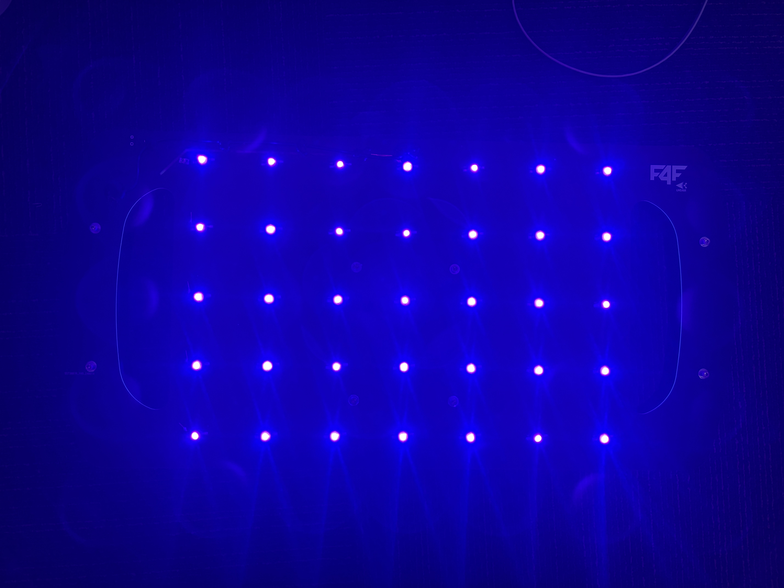
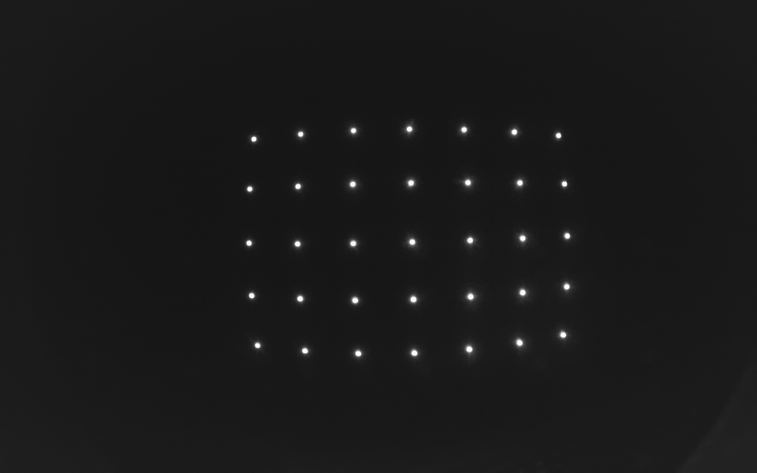

# Camera_Calibration_UVDAR
A Python-based UV-DAR camera calibration tool based on Davide Scaramuzza's OCamCalib model, adapted for UV-sensitive cameras using an LED grid calibration pattern.

This tool is intended for calibrating the UV-sensitive Arducam used on RoboFly / UVDAR systems. The calibration pattern should be a non-square UV LED grid, where the LED markers act like the internal corners of a checkerboard grid.

The Python GUI version provides calibration coverage feedback similar to ROS `camera_calibration`, including image position, size, skew, and reprojection error.

The grid should be non-square, and composed of LEDs emitting in the 395nm range.
An example of such grid:


 

If the camera is constructed correctly, the output image of the pattern should look like this:



## Overview

The full calibration workflow is:

1. Capture UV LED grid images using the Arducam on the Raspberry Pi.
2. Move the captured `.bmp` images into a folder called `photos`.
3. Run the Python calibration GUI.
4. Check that UV markers are detected correctly.
5. Use the coverage graph to determine whether more images are needed.
6. Calibrate the camera.
7. Export the final OCamCalib parameters to `calib_results.txt`.

## 1. Capture Calibration Images on the Raspberry Pi

Before running the Python calibration tool, capture calibration images using the Arducam connected to the Raspberry Pi.

Use the same exposure, gain, image size, and encoding settings for every calibration image.

Use this command to capture one image:
```bash
rpicam-still --shutter 1 -t 5000 -o i_1.bmp --encoding bmp --gain 0.05 --width 960 --height 600
```
For the next image, change the output name:
```bash
rpicam-still --shutter 1 -t 5000 -o i_2.bmp --encoding bmp --gain 0.05 --width 960 --height 600
```
Continue numbering the images:
```text
i_1.bmp
i_2.bmp
i_3.bmp
...
i_25.bmp
```

Recommended capture settings:
```text
shutter:  1
timeout:  5000 ms
encoding: bmp
gain:     0.05
width:    960
height:   600
```
## 2. Capture Good Calibration Images

For good calibration, the UV LED grid must appear in many different parts of the image.

Capture images where:

- the full UV LED grid is visible
- all LEDs are detected clearly
- LED blobs are small and not saturated
- the grid appears near the image center
- the grid appears near the left side of the image
- the grid appears near the right side of the image
- the grid appears near the top of the image
- the grid appears near the bottom of the image
- the grid appears near the image corners
- the grid appears at different distances from the camera
- the grid is tilted in different directions

A good starting point is usually:

```text
15-25 usable images
```

More images can help, but image diversity is more important than the raw image count.

The GUI will help determine whether enough images have been captured.

---

## 3. Move Images into the Python Calibration Folder

On the computer where you run the Python calibration code, create a folder named:

```text
photos
```

Place all captured `.bmp` calibration images inside this folder.

The expected folder structure is:

```text
camera_calibration_python/
├── ocam_calibration_step_gui.py
├── photos/
│   ├── i_1.bmp
│   ├── i_2.bmp
│   ├── i_3.bmp
│   ├── ...
│   └── i_25.bmp
```

The Python calibration script expects:

```text
image folder: photos
base name:    i_
extension:    bmp
```

So the image names should follow this format:

```text
i_1.bmp
i_2.bmp
i_3.bmp
...
```

---

## 4. Install Python Requirements

Install the required Python packages:

```bash
pip install numpy matplotlib opencv-python
```

Optional, for MATLAB `.mat` output:

```bash
pip install scipy
```

---

## 5. Run the UV-DAR Calibration GUI

From the folder containing `ocam_calibration_step_gui.py`, run:

```bash
python ./ocam_calibration_step_gui.py --image_dir photos --base_name i_ --extension bmp --gui
```

On Windows PowerShell, use:

```powershell
python .\ocam_calibration_step_gui.py --image_dir photos --base_name i_ --extension bmp --gui
```

For final calibration, the MATLAB-style slow center search is recommended:

```bash
python ./ocam_calibration_step_gui.py --image_dir photos --base_name i_ --extension bmp --gui --slow_find_center
```

On Windows PowerShell:

```powershell
python .\ocam_calibration_step_gui.py --image_dir photos --base_name i_ --extension bmp --gui --slow_find_center
```

---

## 6. Using the GUI

In the GUI:

1. Click **Load / Analyze Images**.
2. Check that the UV markers are detected correctly.
3. Review the calibration coverage bars.
4. Add more photos if coverage is incomplete.
5. Once coverage is complete, click **CALIBRATE**.
6. Review the reprojection error.
7. Save or export the calibration results.

The GUI checks coverage in several categories:

```text
X coverage:       left / center / right
Y coverage:       top / middle / bottom
Size coverage:    far-small / medium / close-large
Skew coverage:    front-on / tilted
Quadrant coverage
Image count
```

The goal is not just to collect many images. The goal is to collect images that cover the full camera field of view.

---

## 7. Understanding the Coverage Graph

The coverage graph shows where each calibration image places the UV LED grid in the camera image.

The x-axis shows:

```text
horizontal board location in image
```

The y-axis shows:

```text
vertical board location in image
```

Each numbered point corresponds to one calibration image.

The graph also displays reprojection error for each image. For example:

```text
26
0.76px
```

means image 26 has an average reprojection error of `0.76` pixels.

The coverage graph title may look like:

```text
calibration coverage: 100.0% | avg error: 0.347px | max image avg: 0.760px
```

This means:

```text
coverage:       how complete the image-position coverage is
avg error:      average reprojection error across all images
max image avg:  highest average reprojection error from any single image
```

A good calibration usually has:

```text
average reprojection error < 1.0 px
```

Lower is better. Values around:

```text
0.3-0.5 px
```

are generally good.

---

## 8. What Reprojection Error Means

Reprojection error is the difference between the detected UV marker location and the model-predicted UV marker location.

It is not the distance from the image center.

The error is computed approximately as:

```text
error = sqrt((detected_row - projected_row)^2 + (detected_col - projected_col)^2)
```

For each image, the displayed error is the average error across all detected UV markers in that image.

The center-to-point distance is useful for coverage and field-of-view analysis, but it is not calibration error.

---

## 9. Command-Line Calibration Without the GUI

You can also run calibration directly from the terminal.

Fast center search:

```bash
python ./ocam_calibration_step_gui.py --image_dir photos --base_name i_ --extension bmp --no_plots
```

MATLAB-style slow center search:

```bash
python ./ocam_calibration_step_gui.py --image_dir photos --base_name i_ --extension bmp --no_plots --slow_find_center
```

The slow center search is recommended for the final calibration because it is closer to the original MATLAB OCamCalib process.

---

## 10. Coverage-Only Mode

To check image coverage without running full calibration:

```bash
python ./ocam_calibration_step_gui.py --image_dir photos --base_name i_ --extension bmp --coverage_only --show_coverage
```

This mode is useful after adding new images. It lets you check whether the current photo set has enough variation before running the full calibration.
