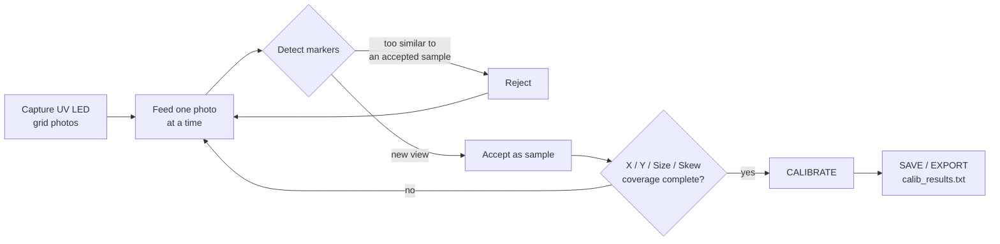

# Camera_Calibration_UVDAR

A Python-based UV-DAR camera calibration tool based on [Davide Scaramuzza's OCamCalib
model](https://sites.google.com/site/scarabotix/ocamcalib-omnidirectional-camera-calibration-toolbox-for-matlab/ocamcalib-toolbox-download-page?authuser=0),
adapted for UV-sensitive cameras using a non-square UV LED grid calibration pattern
(the LEDs act like the internal corners of a checkerboard).

The surrounding workflow mirrors ROS `camera_calibration` (image_pipeline): photos are
fed one at a time into a calibration engine that decides whether to *accept* each view
as a calibration sample, rejecting views that are too similar to one already accepted.
The repository works both as a standalone Python tool and, once built with `colcon`, as
a ROS 2 package with a live `cameracalibrator` node.


## How It Works



Rejecting near-duplicate photos is expected and intentional — it's what produces a
diverse calibration set. Readiness is reported as X / Y / Size / Skew range progress
bars, exactly like the ROS tool. See [Using the GUI](doc/using-the-gui.md) for details.

## Quick Start

**Standalone (no ROS):**

```bash
pip install -r requirements.txt
python -m uvdar_calibrator --image_dir photos --gui
```

**ROS 2** (once built with colcon — see [Running as a ROS 2 Package](doc/ros2-package.md)):

```bash
ros2 run uvdar_calibrator cameracalibrator image:=/camera/image_raw
```

## Documentation

- [Capturing Calibration Images](doc/capturing-images.md) — pattern requirements,
  example capture process, good-image guidelines, folder layout
- [Using the GUI](doc/using-the-gui.md) — step-by-step walkthrough, coverage graph,
  reprojection error
- [Command-Line Usage](doc/command-line.md) — calibrating without the GUI,
  coverage-only mode
- [Running as a ROS 2 Package](doc/ros2-package.md) — colcon build, live
  `cameracalibrator` node
