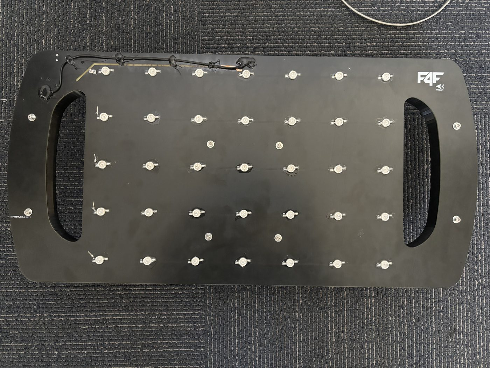
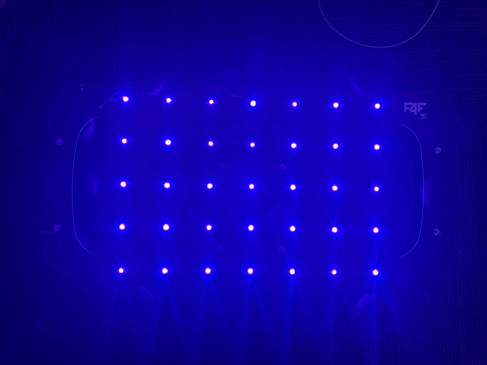
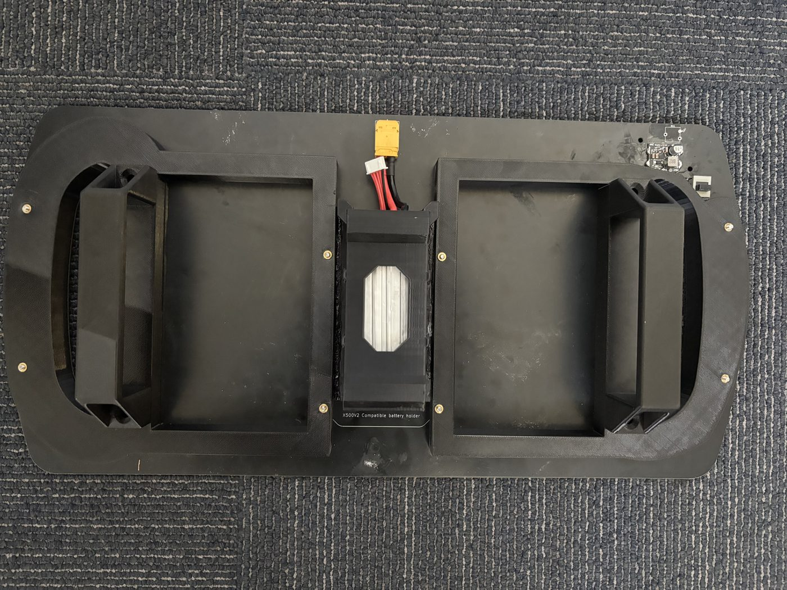

# Capturing Calibration Images

The calibration pattern must be a non-square UV LED grid, where the LED markers act
like the internal corners of a checkerboard grid. The grid should be non-square and
composed of LEDs emitting in the 395nm range.

An example of such a grid:





If the camera is constructed correctly, the output image of the pattern should look
like this:


## Example: Arducam on Raspberry Pi

The following Raspberry Pi / Arducam process is only an example. It is not required
if you are using another camera system or capture tool.

Before running the Python calibration tool, capture calibration images using the
Arducam connected to the Raspberry Pi. Use the same exposure, gain, image size, and
resolution settings for every calibration image.

Use this command to capture one image:

```bash
rpicam-still --shutter 1 -t 5000 -o center_close.bmp --encoding bmp --gain 0.05 --width 960 --height 600
```

The output filename can be anything. For example:

```text
rpicam-still --shutter 1 -t 5000 -o center_close.bmp --encoding bmp --gain 0.05 --width 960 --height 600
rpicam-still --shutter 1 -t 5000 -o left_edge.bmp --encoding bmp --gain 0.05 --width 960 --height 600
rpicam-still --shutter 1 -t 5000 -o top_corner.bmp --encoding bmp --gain 0.05 --width 960 --height 600
```

BMP is recommended for Raspberry Pi capture because it avoids extra compression
artifacts, but the Python calibration script can also read other supported image
types if they are placed in the photos folder.

Recommended capture settings:

```text
shutter:  1
timeout:  5000 ms
encoding: bmp recommended
gain:     0.05
width:    960
height:   600
```

## Capturing Good Calibration Images

For good calibration, the UV LED grid must appear in many different parts of the
image.

Capture images where:

- the full UV LED grid is visible
- all LEDs are detected clearly
- LED blobs are small and not saturated
- the grid appears near the image center
- the grid appears near the left side of the image
- the grid appears near the right side of the image
- the grid appears near the top of the image
- the grid appears near the bottom of the image
- the grid appears near the image corners
- the grid appears at different distances from the camera
- the grid is tilted in different directions

A good starting point is usually 15-25 usable images. More images can help, but
image diversity is more important than the raw image count. The GUI will help
determine whether enough images have been captured.

## Moving Images into the Calibration Folder

On the computer where you run the Python calibration code, create a folder named
`photos` and place all captured calibration images inside it.

The expected folder structure is:

```text
uvdar_calibrator_repo/
├── uvdar_calibrator/        # the calibration package
│   ├── board.py             # LED grid target geometry
│   ├── detection.py         # marker detection (chessboard -> circle grid -> UV dots)
│   ├── ocam_model.py        # OCamCalib/Scaramuzza solver math
│   ├── coverage.py          # sample selection + readiness scoring
│   ├── calibrator.py        # Calibrator engine (accept/reject, solve, export)
│   ├── plots.py             # matplotlib diagnostics
│   ├── gui.py               # Tkinter GUI (batch photo-folder app + live app)
│   ├── cli.py               # command-line entry point (offline/batch mode)
│   └── live_node.py         # ROS 2 node: live topic capture (cameracalibrator)
├── package.xml, setup.py,   # ROS 2 (ament_python) package scaffolding --
│   setup.cfg, resource/     # only needed if building/running via colcon
├── photos/
│   ├── example_01.bmp
│   ├── center_close.bmp
│   ├── left_edge.png
│   ├── top_corner.jpg
│   └── calibration_view_12.tiff
```

The calibration script reads every supported image in the `photos` folder by
default. The images do **not** need to follow a specific naming pattern.

Supported image types:

```text
jpg, jpeg, bmp, png, tif, tiff
```

Valid example filenames:

```text
example_01.bmp
left_corner.png
center_close.jpg
calibration_view_12.tiff
robofly_test_image.bmp
image001.jpeg
```

The only requirements are:

1. The images are inside the photos folder.
2. The images are one of the supported file types.
3. The UV LED grid is visible in the image.

Optional filtering is still available. To use only files beginning with a specific
prefix, use `--base_name`. To use only one image type, use `--extension`. For
example:

```bash
python -m uvdar_calibrator --image_dir photos --base_name example_ --extension bmp --gui
```
