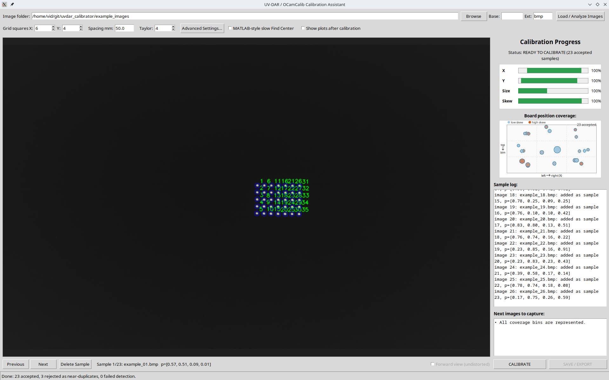

# Using the GUI

## Running It

Install the required Python packages and launch the GUI from the repository root:

```bash
pip install -r requirements.txt
python -m uvdar_calibrator --image_dir photos --gui
```

## Step by Step

1. Click **Load / Analyze Images**. Photos are analyzed one at a time; the
   sample log shows, for each image, whether it was **added** as a sample,
   **rejected** because it is too similar to an already-accepted sample, or
   failed marker detection.
2. Check that the UV markers are detected correctly (browse the accepted
   samples with Previous/Next).
3. Review the four **X / Y / Size / Skew** progress bars. Each bar shows the
   range of that parameter covered by the accepted samples; it turns green
   when the covered range is wide enough.
4. Add more photos if the status says NOT READY (the "Next images to
   capture" box gives hints about what is missing).
5. Once the status says READY TO CALIBRATE, click **CALIBRATE**. (You can
   also calibrate earlier after confirming a warning, but treat the result
   as preliminary.) Tick **Show plots after calibration** first if you want
   the diagnostics window — it is off by default, and the checkbox is read
   when you press CALIBRATE.
6. Review the reprojection error. Once calibrated, the **Forward view
   (undistorted)** checkbox becomes available. It re-renders the frame the
   way an ordinary perspective camera would have seen it, using the model you
   just solved. This is a sanity check: the fisheye bows the grid's rows and
   columns, and a correct model straightens them again, so the LED grid should
   look like a clean perspective rectangle. It works both while browsing
   accepted samples with Previous/Next and, in live mode, on the incoming
   stream.

   The view shows the central 90° and crops the rest, on purpose. A
   perspective projection cannot represent a ray at or past 90° from the
   optical axis, so a fisheye's outer rim is unreachable at *any* setting —
   and widening the view shrinks the pattern you are trying to inspect (at
   160° the grid renders about 5× smaller, which is useless for judging
   straightness).
7. Click **SAVE / EXPORT**. A save dialog opens, defaulting to
   `calib_results.txt` in the output folder — choose where to write it. That
   text file is the only output.

Important: **some photos being rejected is normal and correct.** Two photos
of the grid in nearly the same position, size, and tilt add no new
information, so only the first one is kept. The goal is not to collect many
images — it is to collect images that cover the full camera field of view
with varied positions, sizes, and tilts.



## Understanding the Coverage Graph

With `--show_coverage`, a scatter graph shows where each **accepted** sample
places the UV LED grid in the camera image.

The x-axis shows the horizontal board location in the image; the y-axis shows the
vertical board location in the image. Each labeled point corresponds to one accepted
calibration sample.

A good calibration usually has an average reprojection error below 1.0 px. Lower is
better — values around 0.3-0.5 px are generally good.

## What Reprojection Error Means

Reprojection error is the difference between the detected UV marker location and the
model-predicted UV marker location. It is **not** the distance from the image center.

The error is computed approximately as:

```text
error = sqrt((detected_row - projected_row)^2 + (detected_col - projected_col)^2)
```

For each image, the displayed error is the average error across all detected UV
markers in that image. The center-to-point distance is useful for coverage and
field-of-view analysis, but it is not calibration error.

## The Diagnostics Window

With **Show plots after calibration** ticked, CALIBRATE opens a single window with
one tab per diagnostic. It does not block the GUI — in live mode capture keeps
running behind it. Each tab has the standard matplotlib toolbar, so use the
magnifier to zoom; with 20+ samples the reprojection panels are necessarily small.

| Tab | What it shows | What to look for |
| --- | --- | --- |
| **Reprojection** | One panel per accepted sample: detected markers (`+`) against the model's reprojected grid (`o`) | The two should sit on top of each other. A panel where they drift apart is a bad sample. |
| **Error analysis** | Reprojection error of every marker, per sample | A tight cluster near the origin. A sample that fans out wide is dragging the solve. |
| **Projection function** | The solved polynomial: image radius vs ray angle | A smooth monotonic curve. Wiggles or a fold-back mean the polynomial is overfitted. |
| **Extrinsics** | 3D scatter of where the board was for each sample, in mm relative to the camera | Spread in all directions and a wide range of distances. Points clustered at one distance mean your Size variety is not real; a point behind the camera or absurdly far away is a failed pose that will degrade the whole solve. |

The console also prints the per-sample and average reprojection error alongside
these, whether or not you ask for the plots.
